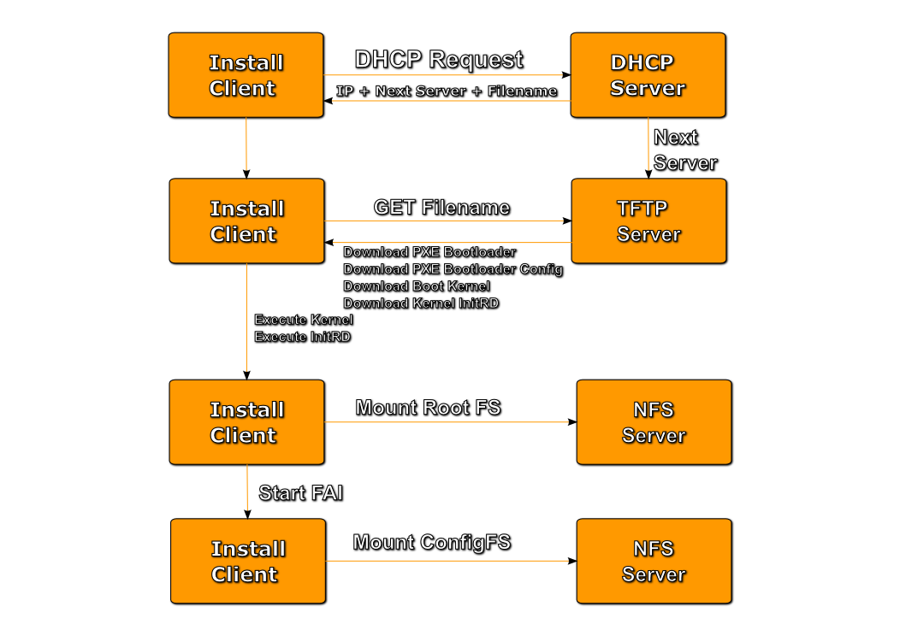

Fully Automatic Installation (FAI)
==================================

`FAI <http://fai-project.org>`_ is a non-interactive system to install, customize and manage Linux systems and software configurations on computers as well as virtual machines and chroot environments, from small networks to large-scale infrastructures and clusters. It's a tool for unattended mass deployment of Linux. You can take one or more virgin PC's, turn on the power, and after a few minutes, the systems are installed, and completely configured to your exact needs, without any interaction necessary.

To get a full picture of `FAI <http://fai-project.org>`_, how it works, what are the features, advantages and disadvantages you should read the documentation on their project website.

.. contents:: Table of Contents
   :depth: 3

Workflow of FAI
---------------

FAI is not easy to understand in the first place. But the diagram below shows you a simple process flow of how FAI works in the first place.

After mounting the ConfigFS FAI is starting some tasks (which are triggered from the FAI Init Script, which runs exclusively via `init <http://savannah.nongnu.org/projects/sysvinit>`_ or `upstart <http://upstart.ubuntu.com/>`_.

Installation of FAI
-------------------

To install `FAI <http://fai-project.org>`_ on the DC² Deployment host you just need to install [#f1]_ ::

    user@home: ~> sudo apt-get install fai-quickstart

This package pulls in everything we need to get started with FAI.
The configuration of FAI is located under /etc/fai/.

Four files are important for the configuration of FAI:

1. /etc/fai/make-fai-nfsroot.conf
2. /etc/fai/fai.conf
3. /etc/fai/NFSROOT
4. /etc/fai/apt/sources.list

We are now adjusting the FAI configuration for our **DC² Deployment Host**.

/etc/fai/make-fai-nfsroot.conf
^^^^^^^^^^^^^^^^^^^^^^^^^^^^^^

This is the default contents of **/etc/fai/make-fai-nfsroot.conf**:

.. code-block:: bash
   :linenos:

   # these variables are only used by make-fai-nfsroot(8)
   # here you can use also variables defined in fai.conf

   # directory on the install server where the nfsroot for FAI is
   # created, approx size: 390MB, also defined in bootptab or dhcp.conf
   NFSROOT=/srv/fai/nfsroot

   # TFTP directory for FAI files
   TFTPROOT=/srv/tftp/fai

   # location of the configuration space on the install server
   FAI_CONFIGDIR=/srv/fai/config

   # Add a line for mirrorhost and installserver when DNS is not available
   # on the clients. This line(s) will be added to $nfsroot/etc/hosts.
   #NFSROOT_ETC_HOSTS="192.168.1.250 yourinstallserver"

   # Parameter for debootstrap: "<suite> <mirror>"
   FAI_DEBOOTSTRAP="squeeze http://cdn.debian.net/debian"

   # the encrypted (with md5 or crypt) root password on all install clients during
   # installation process; used when log in via ssh; default pw is: fai
   FAI_ROOTPW='$1$kBnWcO.E$djxB128U7dMkrltJHPf6d1'
   
   # location of a identity.pub file; this user can log to the install
   # clients in as root without a password; only useful with FAI_FLAGS="sshd"
   #SSH_IDENTITY=/home/admin/.ssh/identity.pub
   
   # directory of hooks to be sourced at the end of make-fai-nfsroot,
   # i.e they have to be shell scripts.
   #NFSROOT_HOOKS=/etc/fai/nfsroot-hooks/

   # - - - - - - - - - - - - - - - - - - - - - - - - - - - - - - - - - -
   # following lines should be read only for most of you

   FAI_DEBOOTSTRAP_OPTS="--exclude=info,dhcp-client --include=aptitude"

Now we need to adjust some variable value:

1. **Line 12**: replace the value with "**/srv/fai/dc2-config**"
2. **Line 16**: replace the value with this line: 
     | NFSROOT_ETC_HOSTS="192.168.100.10   deployment archive
     | 192.168.100.100 dc2db     
     | 192.168.100.101 download"
3. **Line 19**: replace the value with "**oneiric http://archive/oneiric**"

You can change more values, when you read the documentation of FAI later. We are just quickstarting here, just follow this documentation.

The resulting **/etc/fai/make-fai-nfsroot.conf** looks like this:

.. code-block:: bash
   :linenos:

   # these variables are only used by make-fai-nfsroot(8)
   # here you can use also variables defined in fai.conf

   # directory on the install server where the nfsroot for FAI is
   # created, approx size: 390MB, also defined in bootptab or dhcp.conf
   NFSROOT=/srv/fai/nfsroot

   # TFTP directory for FAI files
   TFTPROOT=/srv/tftp/fai

   # location of the configuration space on the install server
   FAI_CONFIGDIR=/srv/fai/dc2-config

   # Add a line for mirrorhost and installserver when DNS is not available
   # on the clients. This line(s) will be added to $nfsroot/etc/hosts.
   NFSROOT_ETC_HOSTS="192.168.100.10   deployment archive
   192.168.100.100 dc2db
   192.168.100.101 download"

   # Parameter for debootstrap: "<suite> <mirror>"
   FAI_DEBOOTSTRAP="oneiric http://archive/oneiric"

   # the encrypted (with md5 or crypt) root password on all install clients during
   # installation process; used when log in via ssh; default pw is: fai
   FAI_ROOTPW='$1$kBnWcO.E$djxB128U7dMkrltJHPf6d1'

   # location of a identity.pub file; this user can log to the install
   # clients in as root without a password; only useful with FAI_FLAGS="sshd"
   #SSH_IDENTITY=/home/admin/.ssh/identity.pub

   # directory of hooks to be sourced at the end of make-fai-nfsroot,
   # i.e they have to be shell scripts.
   #NFSROOT_HOOKS=/etc/fai/nfsroot-hooks/

   # - - - - - - - - - - - - - - - - - - - - - - - - - - - - - - - - - -
   # following lines should be read only for most of you

   FAI_DEBOOTSTRAP_OPTS="--exclude=info,dhcp-client --include=aptitude"

/etc/fai/fai.conf
^^^^^^^^^^^^^^^^^

The contents of this file will also be written in the live RootFS, which is mounted after the FAI Init Script is started. There are several possibilities to fetch or mount this ConfigFS. We are concentrating for a quickstart on the NFS method.

The default contents of the file **/etc/fai/fai.conf** looks like this:

.. code-block:: bash
   :linenos:

   # $Id$

   # /etc/fai/fai.conf -- configuration for FAI (Fully Automatic Installation)

   # how to access the fai config space
   # If undefined here, make-fai-nfsroot/fai-setup will use default value
   # nfs://<install server>/$FAI_CONFIGDIR
   # supported URL-types: nfs, file, cvs, cvs+ssh, svn+file, svn+http,
   # git, git+http, hg+http, tarball via http
   #FAI_CONFIG_SRC=nfs://yourservername/path/to/config/space

   # LOGUSER: an account on the install server which saves all log-files
   # and which can change the kernel that is booted via network.
   # Configure .rhosts for this account and PAM, so that root can log in
   # from all install clients without password. This account should have
   # write permissions for /srv/tftp/fai. For example, you can use write
   # permissions for the group linuxadm. chgrp linuxadm /srv/tftp/fai;chmod
   # g+w /srv/tftp/fai. If the variable is undefined, this feature is disabled.
   # Define it, to enable it, eg. LOGUSER=fai
   LOGUSER=

   # set protocol type for saving logs. Values: ssh, rsh, ftp
   FAI_LOGPROTO=ssh

   # Access to Debian mirror via NFS mounted directory
   # If FAI_DEBMIRROR is defined, install clients mount it to $MNTPOINT
   #FAI_DEBMIRROR=yournfs debianmirror:/path/to/debianmirror

   # The following variables are read only for almost every user.
   # Do not change them unless you know what you are doing!

   # mount point where the mirror will be mounted
   MNTPOINT=/media/mirror

   # the local configuration directory on the install client
   FAI=/var/lib/fai/config

We are now changing some values:

1. **Line 10**: Remove the hash sign and change the value to "**nfs://deployment01/srv/fai/dc2-config**" 

The resulting contents looks like this now:

.. code-block:: bash
   :linenos:

   # $Id$

   # /etc/fai/fai.conf -- configuration for FAI (Fully Automatic Installation)

   # how to access the fai config space
   # If undefined here, make-fai-nfsroot/fai-setup will use default value
   # nfs://<install server>/$FAI_CONFIGDIR
   # supported URL-types: nfs, file, cvs, cvs+ssh, svn+file, svn+http,
   # git, git+http, hg+http, tarball via http
   FAI_CONFIG_SRC=nfs://deployment01/srv/fai/dc2-config

   # LOGUSER: an account on the install server which saves all log-files
   # and which can change the kernel that is booted via network.
   # Configure .rhosts for this account and PAM, so that root can log in
   # from all install clients without password. This account should have
   # write permissions for /srv/tftp/fai. For example, you can use write
   # permissions for the group linuxadm. chgrp linuxadm /srv/tftp/fai;chmod
   # g+w /srv/tftp/fai. If the variable is undefined, this feature is disabled.
   # Define it, to enable it, eg. LOGUSER=fai
   LOGUSER=

   # set protocol type for saving logs. Values: ssh, rsh, ftp
   FAI_LOGPROTO=ssh

   # Access to Debian mirror via NFS mounted directory
   # If FAI_DEBMIRROR is defined, install clients mount it to $MNTPOINT
   #FAI_DEBMIRROR=yournfs debianmirror:/path/to/debianmirror

   # The following variables are read only for almost every user.
   # Do not change them unless you know what you are doing!

   # mount point where the mirror will be mounted
   MNTPOINT=/media/mirror
   
   # the local configuration directory on the install client
   FAI=/var/lib/fai/config

/etc/fai/NFSROOT
^^^^^^^^^^^^^^^^

The contents of this file describes the packages to be installed in the installation root filesystem, which will be mounted during installation.
The syntax is the same as the package_config configuration files inside the FAI ConfigFS. Please read the documentation on the `FAI Homepage <http://fai-project.org>`_ about the explicit syntax of those files.

The original contents of the file is:

.. code-block:: text
   :linenos:

   # package list for creating the NFSROOT

   PACKAGES aptitude
   nfs-common fai-nfsroot module-init-tools ssh rdate lshw portmap
   rsync lftp less dump reiserfsprogs e2fsprogs usbutils
   hwinfo psmisc pciutils hdparm smartmontools parted mdadm lvm2
   dnsutils ntpdate dosfstools jove xfsprogs xfsdump
   procinfo dialog discover
   console-setup console-common
   iproute udev subversion liblinux-lvm-perl

   # needed for the simple examples
   cfengine2 libapt-pkg-perl

   # you should not edit the lines below
   # architecture dependend list of packages that are installed

   PACKAGES aptitude I386
   grub-pc lilo read-edid
   linux-image-server

   # packages for lenny:
   # linux-image-486 aufs-modules-2.6-486

   PACKAGES aptitude AMD64
   grub-pc lilo
   linux-image-server
   # packages for lenny:
   # linux-image-2.6-amd64 aufs-modules-2.6-amd64

   PACKAGES aptitude IA64
   elilo gnu-efi efibootmgr
   
   PACKAGES aptitude SPARC
   silo sparc-utils

   PACKAGES aptitude ALPHA
   aboot

   PACKAGES aptitude POWERPC
   linux-image-2.6-powerpc
   yaboot

Please change the following lines:

1. **Line 12**: Replace the line with "**dc2-client**"
2. **Line 13**: Delete the line

The resulting contents looks like this:

.. code-block:: text
   :linenos:

   # package list for creating the NFSROOT

   PACKAGES aptitude
   nfs-common fai-nfsroot module-init-tools ssh rdate lshw portmap
   rsync lftp less dump reiserfsprogs e2fsprogs usbutils
   hwinfo psmisc pciutils hdparm smartmontools parted mdadm lvm2
   dnsutils ntpdate dosfstools jove xfsprogs xfsdump
   procinfo dialog discover
   console-setup console-common
   iproute udev subversion liblinux-lvm-perl

   dc2-client

   # you should not edit the lines below
   # architecture dependend list of packages that are installed

   PACKAGES aptitude I386
   grub-pc lilo read-edid
   linux-image-server

   # packages for lenny:
   # linux-image-486 aufs-modules-2.6-486

   PACKAGES aptitude AMD64
   grub-pc lilo
   linux-image-server
   # packages for lenny:
   # linux-image-2.6-amd64 aufs-modules-2.6-amd64

   PACKAGES aptitude IA64
   elilo gnu-efi efibootmgr
   
   PACKAGES aptitude SPARC
   silo sparc-utils

   PACKAGES aptitude ALPHA
   aboot

   PACKAGES aptitude POWERPC
   linux-image-2.6-powerpc
   yaboot

/etc/fai/apt/sources.list
^^^^^^^^^^^^^^^^^^^^^^^^^

This is actually a "copy" of a standard debian /etc/apt/sources.list file.
But, we created a package archive in the first step, so we are going to use our created package archive.
This file will be used only once, during the creation of the FAI NFSRoot directory, which is actually the root filesystem which is being mounted
after the installation kernel is executed.

This is the original contents of /etc/fai/apt/sources.list:

.. code-block:: text
   :linenos:

   # These lines should work for many sites
   # A more comprehensive example is at /usr/share/doc/fai-doc/examples/etc

   deb http://archive.ubuntu.com/ubuntu precise main restricted universe multiverse
   deb http://archive.ubuntu.com/ubuntu precise-security main restricted universe multiverse
   deb http://archive.ubuntu.com/ubuntu precise-updates main restricted universe multiverse

   # repository that may contain newer fai packages for squeeze
   #deb http://fai-project.org/download squeeze koeln

You have to replace the following lines:

1. **Line 4 + 5 + 6**: Replace it with this::

    deb http://archive/oneiric oneiric main restricted universe multiverse
    deb http://archive/oneiric oneiric-security main restricted universe multiverse
    deb http://archive/oneiric oneiric-updates main restricted universe multiverse
    deb http://ppa.launchpad.net/dc2/backports/ubuntu oneiric main

So the resulting file looks like this:

.. code-block:: text
   :linenos:

   # These lines should work for many sites
   # A more comprehensive example is at /usr/share/doc/fai-doc/examples/etc

   deb http://archive/oneiric oneiric main restricted universe multiverse
   deb http://archive/oneiric oneiric-security main restricted universe multiverse
   deb http://archive/oneiric oneiric-updates main restricted universe multiverse
   deb http://ppa.launchpad.net/dc2/backports/ubuntu oneiric main

   # repository that may contain newer fai packages for squeeze
   #deb http://fai-project.org/download squeeze koeln

NFS Server Configuration
------------------------

Now we need to configure the NFS Kernel Server on the DC² Deployment host. Especially we need to adjust the **/etc/exports** file.
This file defines the exported shares, which can be mounted on remote hosts.

When you don't know anything or a little about NFS Server on Linux please read the `Linux NFS Overview, FAQ and HowTo Page <http://nfs.sourceforge.net>`_.

To get going just copy the following contents to **/etc/exports**:

.. code-block:: text 
   :linenos:

   #
   # Example for NFSv4:
   # /srv/nfs4        gss/krb5i(rw,sync,fsid=0,crossmnt,no_subtree_check)
   # /srv/nfs4/homes  gss/krb5i(rw,sync,no_subtree_check)
   #

   /srv/fai/nfsroot	192.168.100.0/24(async,ro,no_subtree_check,no_root_squash)
   /srv/fai/dc2-config	192.168.100.0/24(async,ro,no_subtree_check)

TFTPD-HPA Configuration
-----------------------

We need for the initial PXE Booting a file which is being served by TFTP. As the default TFTP Server the package **tftpd-hpa** was installed.
There is only one adjustment to be made the file **/etc/default/tftpd-hpa**:

.. code-block:: bash
   :linenos:

   # /etc/default/tftpd-hpa

   TFTP_USERNAME="tftp"
   TFTP_DIRECTORY="/srv/tftp/fai/"
   TFTP_ADDRESS="0.0.0.0:69"
   TFTP_OPTIONS="--secure"

Creating Missing Directories
----------------------------

We still have some directories to create, which are not existing at this stage.
If you do a standard FAI installation these directories are being created during the intial "**make-fai-nfsroot**" call, but we create them
a bit earlier, because we still have some steps to do.

So, create the following directories like this:

.. code-block:: bash
   :linenos:

   user@home: ~> sudo mkdir /srv/tftp/fai
   user@home: ~> sudo mkdir /srv/fai/

Copy some needed files
----------------------

We need some files in our TFTP Directory. These files are the bootloaders for PXE Booting. 

The most important one, which is being loaded through the TFTP stage during PXE Booting is "**undionly.kpxe**" (Found in the **ipxe** package)
Furthermore we need (later during the pxe boot process) some files named "**pxelinux.0**" and "**chain.c32**" (Found in the **syslinux** package)

So copy those files like this:

.. code-block:: bash
   :linenos:

   user@home: ~> sudo cp /usr/lib/ipxe/undionly.kpxe /srv/tftp/fai/
   user@home: ~> sudo cp /usr/lib/syslinux/pxelinux.0 /srv/tftp/fai/
   user@home: ~> sudo cp /usr/lib/syslinux/chain.c32 /srv/tftp/fai/

Create the NFS Root filesystem
------------------------------

.. rubric:: Footnotes

.. [#f1] If you installed the **dc2-server** package, this package is already installed.

