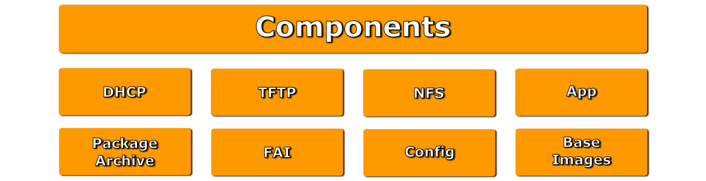

Quickstart 
==========

There are several installation steps to do.
First of all, before you start to use DC² in a production environment, you should build up a testing environment.
To give you a short wrap up about a simple environment to test DC², please prepare a VM Environment with the following setup:

DC² Deployment Host
-------------------

The DC² deployment host should have at least:

* 2 Network Interfaces, the first one to reach the internet, the second one to have a single network without connection to the outside (this is needed for DHCP Requests)
* Round about 100G storage (for a local package archive)
* As Operating System you install Ubuntu 11.10 (Oneiric Ocelot)

To ease the documentation we declare this:

1. The DHCP Network on the Second Interface: 192.168.100.0/24
2. The Second Network Interface will get the IP: 192.168.100.10/32
3. We need also two virtual IPs on the second network interface:

  1. 192.168.100.100/32
  2. 192.168.100.101/32

4. Edit your /etc/hosts file and add the following::

    192.168.100.10  deployment archive
    192.168.100.100 dc2db
    192.168.100.101 download
   

After finishing the pre-requisite steps (Install Ubuntu 12.04 LTS, adding the network interfaces, changing your hosts file etc.) we are ready to start with the installation of the DC² Application  Server Backend. For this, we will install DC² Application Server, FAI and the Package Archive Mirror on the same machine. In a live environment this can be shared among servers. 
More about scaling the infrastructure later.

Add the Personal Package Archive of DC²
^^^^^^^^^^^^^^^^^^^^^^^^^^^^^^^^^^^^^^^

All the steps needed you can find on the `DC² Project PPA Page <https://launchpad.net/~dc2/+archive/releases>`_ on `Launchpad <https://launchpad.net/>`_, but to make easier here are the commands::

    user@home: ~> sudo add-apt-repository ppa:dc2/backports
    user@home: -> sudo apt-get update

in case you don't have add-apt-repository installed you should do install it first with::

    user@home: ~> sudo apt-get install python-software-properties

Components of DC² Application Server
------------------------------------

We have a lot of components on which DC² depends. Most of them come from FAI, others will be pulled in by DC² itself.

To have a full fledged DC² Deployment Server you just install::

    user@home: ~> sudo apt-get install dc2-server

You will get the full installation packages of DC² Application Server, FAI, NFS Server, TFTP Server, Syslinux PXE, iPXE and Apache.
On the following pages we will show the installation and configuration of the standalone components.
We will start with preparing the :doc:`package archive <package-archive/index>`.

.. toctree::
   :maxdepth: 1

   Package Archive <package-archive/index>
   Fully Automatic Installation (FAI) <fai/index>
